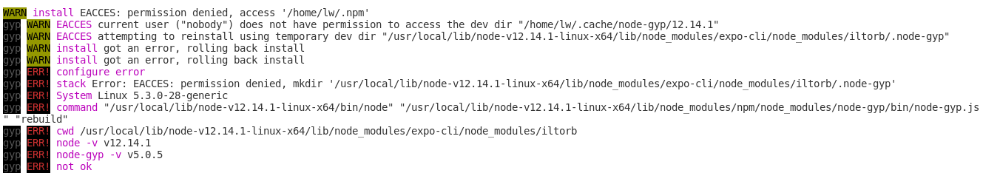
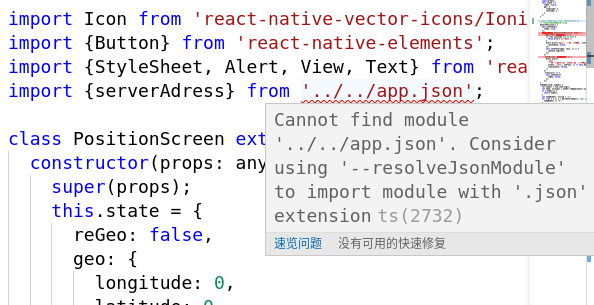
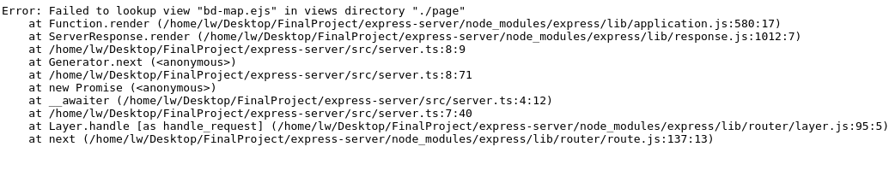
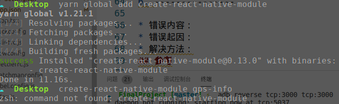
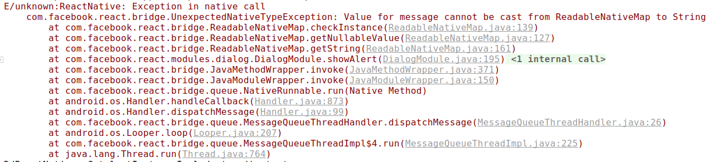
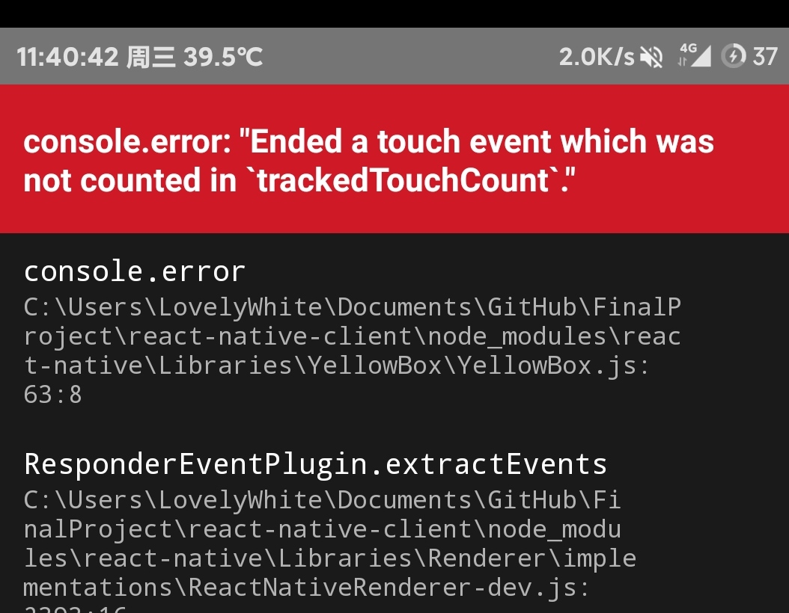

#  多源手机信息采集平台(FinalProject)  

* [功能框架](#1)
* [消息传递](#2)
* [服务器接口定义](#3)
* [随笔](#4)
* [踩坑记录](#5)
* [收获(学到的知识)](#6)
* [参考](#7)
* [版权声明](#8)

多源手机信息采集平台是一款能够使用移动设备进行传感器信息采集、分析和可视化的软件。(Multi-source mobile phone information collection platform)

* **数据丰富：** 利用手机平台的传感器的多样性和可移动性，可以方便的在不同时间与空间进行大量的数据收集。可采集的数据有：[大气温度](https://developer.android.google.cn/reference/android/hardware/Sensor.html#TYPE_AMBIENT_TEMPERATURE)、[重力](https://developer.android.google.cn/reference/android/hardware/Sensor.html#TYPE_GRAVITY)、[环境地磁场](https://developer.android.google.cn/reference/android/hardware/Sensor.html#TYPE_MAGNETIC_FIELD)、[气压](https://developer.android.google.cn/reference/android/hardware/Sensor.html#TYPE_PRESSURE)、[相对湿度](https://developer.android.google.cn/reference/android/hardware/Sensor.html#TYPE_RELATIVE_HUMIDITY)、[设备温度](https://developer.android.google.cn/reference/android/hardware/Sensor.html#TYPE_TEMPERATURE)，详细传感器信息请访问[这个链接](https://developer.android.google.cn/guide/topics/sensors/sensors_overview)。

* **多平台适应：** 本平台采用[ReactNative(v0.6.1)](https://reactnative.cn/)进行手机端的程序编写，React Native允许我们使用[TypeScript(v3.7)](https://www.typescriptlang.org/)语言进行多端原生UI组件的编写，与此同时还可以使用Native Module 进行手动封装模块代码。后端采用了Express + nodejs 框架对服务进行处理。

* **数据可视化：** 将采集到的数据上传到服务器，并采用特殊算法进行处理加工（也会保存原始数据）。并将采集到的数据加工出来。

* **可扩展性：** 本平台预先开发了一套应用处理接口，方便开发者后续扩展功能。

##  1. <a id='1'></a>功能框架
###  1.1. 手机端

###  1.2. 服务器端

##  2.<a id='2'></a>消息传递

* **Android<->ReactNative**

    可通过ReactNative NativeModule中被`@ReactMethod`注释的方法。
  
  ```java
    //Android
    @ReactMethod
    public void isListening(String str,Promise promise){
        if(locationListener == null){
            promise.resolve(false);
        }
        else
        {
            promise.resolve(true);
        }
    }
    ```

  ```typescript
    //ReactNative
    export function isListening(str:string): Promise<boolean>

    ```

    通过此方法传入的参数可向Android同名方法传参比如`str`，通过`Promise`对象可向ReactNative发送一个`Object`，比如`boolean`。

* **ReactNative->WebView**

  ```javascript
    //ReactNative端
    <WebView
        ref={'webview'}
        source={{ uri: serverAdress + 'page/bd-map' }}
        onLoadEnd={() => {
          this.state.webview = this.refs.webview;
        }}
      />
  ```

  当初始化一个webview组件的时候将该组件的`ref`存入`state`当中保存起来，之后可用该真实对象`this.state.webview`的`postMessage(str:string)`方法向webview注入消息。
  
  ```javascript
    //webview端
     document.addEventListener("message", function(event) {
    let data = event.data;
    let obj = JSON.parse(data);
    obj.fun && eval(obj.fun + "(" + data + ")");
  });
  ```
  
  webview端在dom初始化以后注册一个`message`事件的监听器，通过该监听器即可响应`postMessage`方法传过来的内容。

##  3. <a id='3'></a>服务器接口定义

请求前缀 ：http://localhost:3000/api/{module}

|module|提交方式|参数|描述|
:-: | :-: | :-: | :-: |
bd-map|GET|-|获取自定义百度地图

##  4. <a id='4'></a>随笔

本项目是一个毕业设计项目，也是我的第一个React-Native 项目。其中的内容难免会有些错误，欢迎大家提Issue，我也会认真的完成这个项目的。觉得还不错的话欢迎Star，本人博客地址：[一只小白喵的进阶之路](https://lovelywhite.cn/)。

##  5. <a id='5'></a>踩坑记录

**1. expo-cli 安装的时候出错**

* 错误内容：npm ERR! Error: EACCES: permission denied, access


* 错误起因：因为要导入sensors包，expo install expo-sensors，所以需要安装expo-cli。安装expocli的时候出现这种错误。
* 解决方法：sudo npm install --unsafe-perm=true --allow-root ([链接](https://blog.csdn.net/testcs_dn/article/details/78869419))

**2. typescript 导入不了json模块**

* 错误内容：Cannot find module '../../app.json'. Consider using '--resolveJsonModule' to import module with '.json' extension


* 错误起因：需要使用JSON当中的常量字符串，发现导入不了
* 解决方法：在`tsconfig.json`中加入"resolveJsonModule":true 就可解决。

**3. ejs找不到模板**

* 错误内容：Error: Failed to lookup view "bd-map.ejs" in views directory"./page" 


* 错误起因：-
* 解决方法：原来`app.set('views', './page')`语句的第二个参数的相对路径为项目目录而不是server.ts的目录，把`./page` 改成`./src/page` 就可以了。

**4. 手机端载入不了计算机建立的express服务器**

* 错误内容：-
* 错误起因：-
* 解决方法：使用`adb reverse tcp:3000(手机端) tcp:3000(计算机端)`将计算机的3000端反代到手机的3000端口。

**5. yarn 安装全局包后找不到命令**

* 错误内容：-
* 错误起因：安装 yarn global add create-react-native-module 后无法使用。


* 解决方法：我使用的是zsh，没有配置yarn的执行目录，将export P ATH="$PATH:`yarn global bin:$HOME/.config/yarn/global/node_modules/.bin"`添加到~/.zshrc文件即可。

**6. getLastKnownLocation() 返回为null**

* 错误内容：-
* 错误起因：编写gps-info native模块需要获取定位数据
* 解决方法：根据资料显示，90%的时候该方法都返回为`null`，所以我们不能使用这个方法来获取位置，而是使用监听位置变动的方法。`LocationListener`最好在`Activity`的`onCreate()`方法中进行实例化，当GPS获得Location时，会自动调用`onLocationChanged`方法。

**7. ReactNative 红色错误(待进一步学习)**

* 错误内容：Value for message cannot be cast from ReadableNativeMap to String
* 错误起因：编写 async 和 await 时出现的错误。通过Android返回的Promise是字符串，可以直接在Alert输出，但是在JS中new一个promise以后返回的是ReadableNativeMap类型，不能用在Alert.alert(str:string)方法中。


* 解决方法：将返回值res转化为string即可。

**8. ReactNative 红色错误**

* 错误内容：Ended a touch event which was not counted in `trackedTouchCount`
* 错误起因：无意之间截图发现的错误。


* 解决方法：将`console.reportErrorsAsExceptions = false`添加到`index.js`。[_Link](https://github.com/facebook/react-native/issues/15059)

##  6.<a id='6'></a>收获(学到的知识)

1.Android内置GPS获取的坐标为角度坐标，采用的坐标系为WGS84，百度地图可使用`Convertor.translate(points: Array<BMap.Point>, from: number, to: number, callback: function)`变换为百度坐标。下面两个链接分别是百度地图中关于转换的API文档和详细参数参考
[JavaScript API](http://lbsyun.baidu.com/cms/jsapi/reference/jsapi_reference_3_0.html#a7b55)
[Web服务 API](http://lbsyun.baidu.com/index.php?title=webapi/guide/changeposition)

##  7. <a id='7'></a>参考

###  7.1. 视频

* [Nodejs+Express+Mongo实战TodoList(共17讲)](https://www.bilibili.com/video/av20196752)
* [Create native modules in react native for android | free code tutorials](https://www.youtube.com/watch?v=OEV3iArNpTM)

### 7.2. 第三方库

* [react-native-elements](https://react-native-elements.github.io/react-native-elements/)
* [react-native-paper](https://callstack.github.io/react-native-paper/index.html)
* [react-native-permissions](https://www.npmjs.com/package/react-native-permissions)
* [react-native-raw-bottom-sheet](https://www.npmjs.com/package/react-native-raw-bottom-sheet)
* [react-native-splash-screen](https://www.npmjs.com/package/react-native-splash-screen)
* [react-native-vector-icons](https://www.npmjs.com/package/react-native-vector-icons)


##  8. <a id='8'></a>版权声明

本软件遵循GNUv3开源协议。
